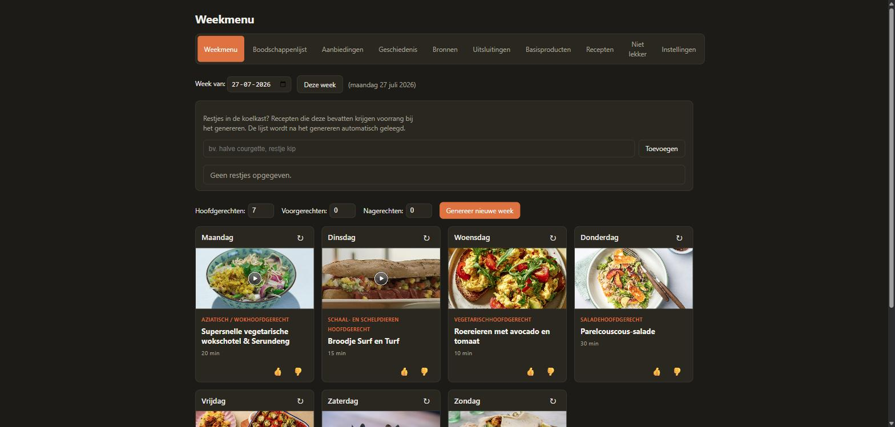
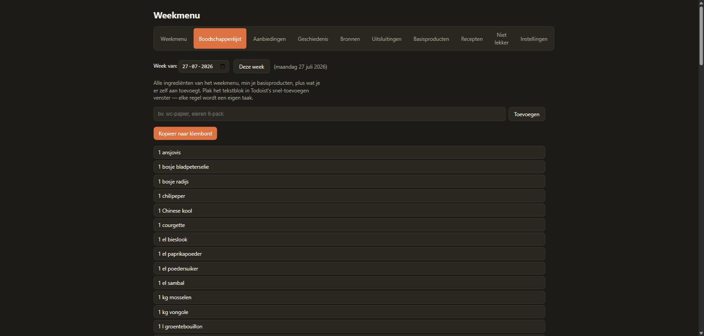
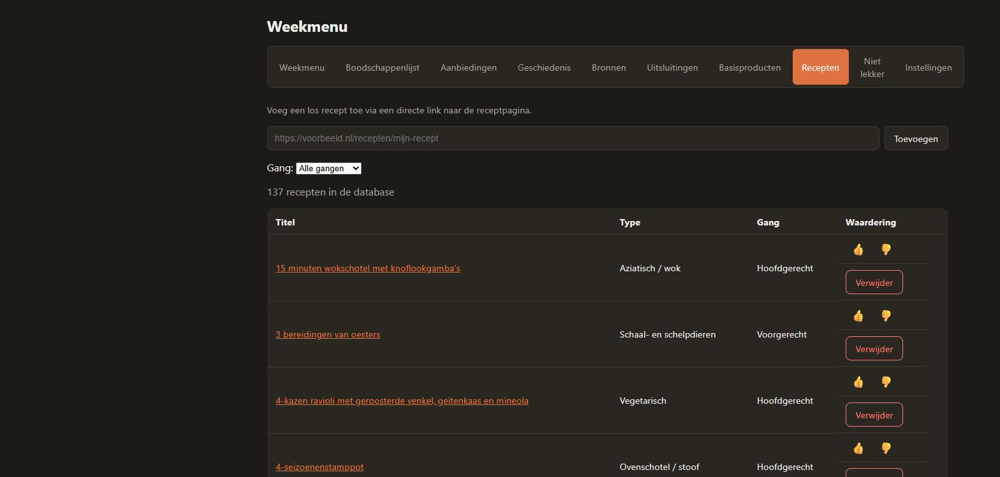
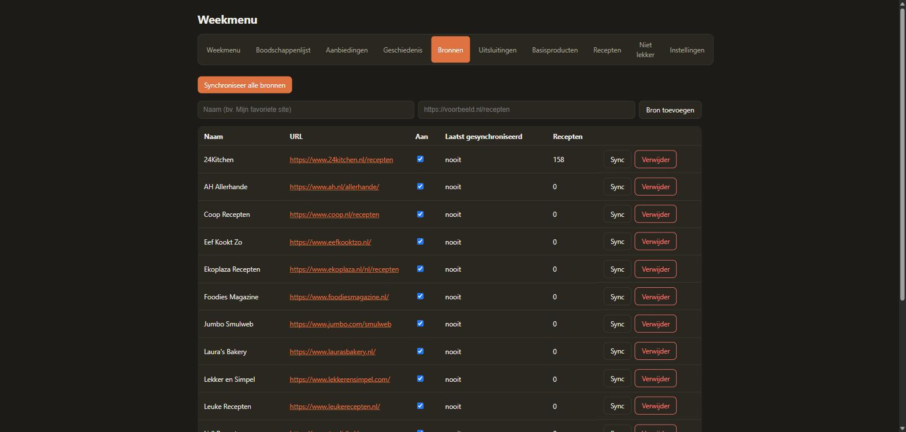

# Weekmenu

Self-hosted web app for putting together your weekly menu. Fetches recipes
from the sites you configure yourself (pre-filled by default with the Dutch
recipe sites from [kadaza.nl/recepten](https://www.kadaza.nl/recepten)),
randomly fills 7 days with variety in dish type, and takes into account
ingredients you want to exclude (e.g. "fish" also excludes cod, salmon, ...).

## Features

- **Multi-source recipe scraping** — add any recipe site with a sitemap and
  schema.org/Recipe markup; no site-specific scraper code needed.
- **Smart exclusions** — exclude a whole category (fish, nuts, pork,
  dairy, ...) or a single ingredient; categories automatically expand to all
  their synonyms.
- **Weekly menu generation** — randomly fills 7 days with variety across
  dish types and courses (starter/main/dessert), honoring your exclusions.
- **Day rerolls & ratings** — swap out a single day's recipe, or like/dislike
  recipes to steer future selections (disliked recipes are never suggested
  again).
- **Week freezing** — lock a week's menu once the groceries are done, so it
  can't be regenerated or changed by accident.
- **Automatic shopping list** — built from the week's recipes with
  duplicate ingredients merged, plus one-off extras and quick-add frequent
  items.
- **Offers & leftovers** — synced supermarket discounts and tracked
  leftovers are preferred during menu generation so nothing goes to waste.
- **Pantry staples** — always-on-hand items (salt, oil, ...) are left off
  the shopping list automatically.
- **History** — browse and reuse previous weeks' menus.
- **Customizable look** — pick your own background and accent color for the
  app, and switch the UI language between English and Dutch.

## Screenshots

| Weekly menu | Shopping list |
|---|---|
|  |  |

| Recipes | Sources |
|---|---|
|  |  |

## How it works

- **Sources**: each source is a recipe site. The app finds the site's
  sitemap itself, locates recipe pages within it, and reads the structured
  recipe data (schema.org/Recipe) that virtually all modern recipe sites
  already have in their page code by default. So no site-specific scraper
  code is needed — add a new site via the **Sources** tab and sync.
- **Exclusions**: via the **Exclusions** tab you can specify a category
  (fish, nuts, pork, dairy, ...) or a single ingredient. Categories are
  expanded with synonyms via `backend/app/data/taxonomy.json` — edit this
  file to add your own categories/synonyms.
- **Weekly menu**: the 7 days are filled randomly, spread across different
  dish types (soup, pasta, fish, meat, vegetarian, ...) so the week doesn't
  keep serving the same kind of dish. Use the ↻ button on a day to swap that
  one recipe for another. Once you've done the groceries for a week, freeze
  it to protect it from accidental changes.

## Getting started (Docker)

Every push to `main` automatically builds the backend and frontend images
and publishes them to the GitHub Container Registry
(`ghcr.io/wnijhof/menuapp-backend` / `menuapp-frontend`, see
`.github/workflows/docker-publish.yml`). That means: **no local build
needed to install** — `docker compose` pulls the ready-made images.

### Option 1: docker compose (recommended)

**1. Create a folder and get the code**, on the machine where the app
should run (e.g. your Ubuntu server, via SSH) — technically only
`docker-compose.yml` is needed, but cloning the whole repo is simpler:

```bash
mkdir -p ~/weekmenu
cd ~/weekmenu
git clone https://github.com/WNijhof/MenuApp.git .
```

No git available, or prefer to copy manually? An `rsync`/`scp` of the
project folder from your own computer to `~/weekmenu` on the server works
just as well — in that case skip the `git clone` step above.

**2. Start the containers**, from that same folder:

```bash
cd ~/weekmenu
docker compose up -d
```

This **pulls** the pre-built images (no local build, so it's fast) and
starts both containers, including the shared network and the storage
volume for the database. Check that both are running:

```bash
docker compose ps
```

The app is then available at `http://<server-ip>:8080`.

**3. Managing:**

```bash
docker compose logs -f backend   # view logs
docker compose restart backend   # restart the container
docker compose down              # stop (the database is kept in the menuapp-data volume)
```

**4. Updating** to a newer version:

```bash
cd ~/weekmenu
docker compose pull   # fetches the latest published images
docker compose up -d
```

**Prefer to build from source yourself** (e.g. to test local changes)
instead of using the published images? Add `--build` — that overwrites the
pulled image with a locally built one:

```bash
docker compose up -d --build
```

### Option 2: standalone docker run commands

Without Compose, you start the two containers yourself, using the
pre-built images (`docker pull` instead of `docker build`). They need to be
on the same Docker network, **and** the backend container must be named
exactly `backend` — the frontend container (nginx) forwards `/api`
requests to `http://backend:8000`, which only works via Docker's own name
resolution within a shared network:

```bash
# Own network and volume for persistent data
docker network create weekmenu-net
docker volume create weekmenu-data

# Pull the pre-built images (no local build needed)
docker pull ghcr.io/wnijhof/menuapp-backend:latest
docker pull ghcr.io/wnijhof/menuapp-frontend:latest

# Start the backend (the name "backend" is required, see above)
docker run -d \
  --name backend \
  --network weekmenu-net \
  --restart unless-stopped \
  -v weekmenu-data:/data \
  ghcr.io/wnijhof/menuapp-backend:latest

# Start the frontend, port 8080 on the host
docker run -d \
  --name frontend \
  --network weekmenu-net \
  --restart unless-stopped \
  -p 8080:80 \
  ghcr.io/wnijhof/menuapp-frontend:latest
```

The app is now also available at `http://<server-ip>:8080`. Updating: pull
the new images, replace the containers (`docker rm -f backend frontend`
and `docker run` again) — the `weekmenu-data` volume is left untouched.

Prefer to build from source yourself? Replace the `docker pull` lines with
`docker build -t weekmenu-backend ./backend` (and `weekmenu-frontend` for
the frontend), and use that name instead of the `ghcr.io/...` image in the
`docker run` commands.

### First use (either option)

Recipes aren't fetched automatically on first start — go to **Sources**
and click **Sync all sources** (can take a few minutes). After that, an
automatic daily sync also runs (at 03:00 at night).

## Adding your own sources

On the **Sources** tab, fill in a name and the URL of the site (the
homepage or a recipe overview page is enough, e.g.
`https://www.example.com/recipes`). The app itself looks for
`sitemap.xml`/`robots.txt` to find recipe pages. If the site doesn't use a
sitemap, or its pages have no schema.org data, no recipes will simply be
found for that source — that's a limitation of the site itself, not
something to configure.

Individual recipes (one specific page) can be added directly via the
**Recipes** tab → add by URL.

## Local development (without Docker)

Backend:

```bash
cd backend
python -m venv .venv
./.venv/Scripts/activate  # or source .venv/bin/activate on Linux/Mac
pip install -r requirements.txt
uvicorn app.main:app --reload
```

Frontend:

```bash
cd frontend
npm install
npm run dev
```

The Vite dev server proxies `/api` to `http://localhost:8000`.
